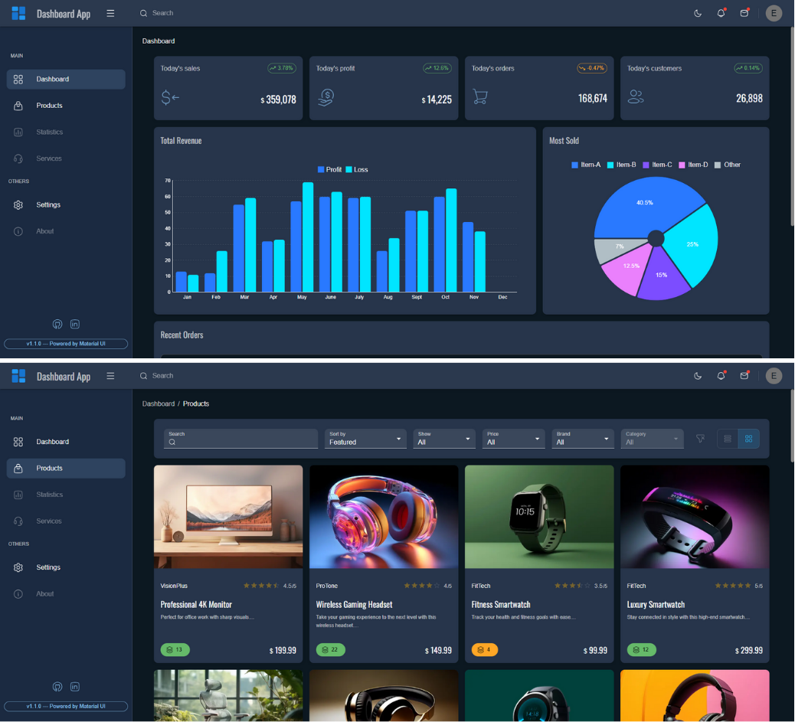

Here’s the updated release note using descriptions for the **Features** and **Technologies Used** sections:

---

# Next.js Dashboard App  
A dynamic and feature-rich dashboard application built with Next.js. This app provides secure user authentication, theme customization, and seamless data visualization for enhanced user experience.  

## Screenshot  
  <!-- Replace with the path to your screenshot image -->

## Live Demo  
You can try out the live demo of this project [here](https://reactjs-app-todo-list.vercel.app/).

## Features  
- **Authentication and Authorization**: Ensures secure access by using NextAuth.js with support for "Credential" and "GitHub" providers.  
- **Skeleton Placeholder**: Enhances user experience by displaying a placeholder while content is loading.  
- **Color Mode of Theme**: Offers Light, Dark, and System theme modes for personalized appearance preferences.  
- **Static and Dynamic Routes**: Includes pre-defined static and programmatic dynamic routes for navigation.  
- **Route Handlers for API**: Provides backend API routes to retrieve and manage data efficiently.  

## Technologies Used  
- **Next.js**: A powerful React framework for building server-rendered and static web applications.  
- **NextAuth.js**: A robust authentication library for securing user login and authorization.  
- **Material UI**: A modern and customizable component library for React.  
- **X Chart and X Data Grid**: Libraries for implementing data visualization and interactive grids.  
- **Huge Icons (Free Stroke style)**: Icon set providing clear and scalable visuals.  

## Installation  

### Using Create Next App  
To get started with the project locally, follow these steps:  

1. Clone the repository:  
   ```bash  
   git clone https://github.com/EthanEDev/nextjs-dashboard-app.git  
   ```  

2. Navigate to the project directory:  
   ```bash  
   cd nextjs-dashboard-app  
   ```  

3. Install dependencies:  
   ```bash  
   npm install  
   ```  

4. Start the development server:  
   ```bash  
   npm run dev  
   ```  

   Open [http://localhost:3000](http://localhost:3000) in your browser to explore the app.  

## Contributing  
Contributions are welcome! If you have suggestions for improvements or find bugs, please open an issue or submit a pull request.  

1. Fork the repository.  
2. Create a new branch:  
   ```bash  
   git checkout -b feature-branch  
   ```  
3. Commit your changes:  
   ```bash  
   git commit -am 'Add new feature'  
   ```  
4. Push to the branch:  
   ```bash  
   git push origin feature-branch  
   ```  
5. Open a Pull Request.  

## License  
This project is licensed under the MIT License - see the [LICENSE](./LICENSE) file for details.  

## Contact  
If you have any questions, feel free to reach out to me via GitHub issues or at ethan.ekhtiyar@gmail.com.  

---
